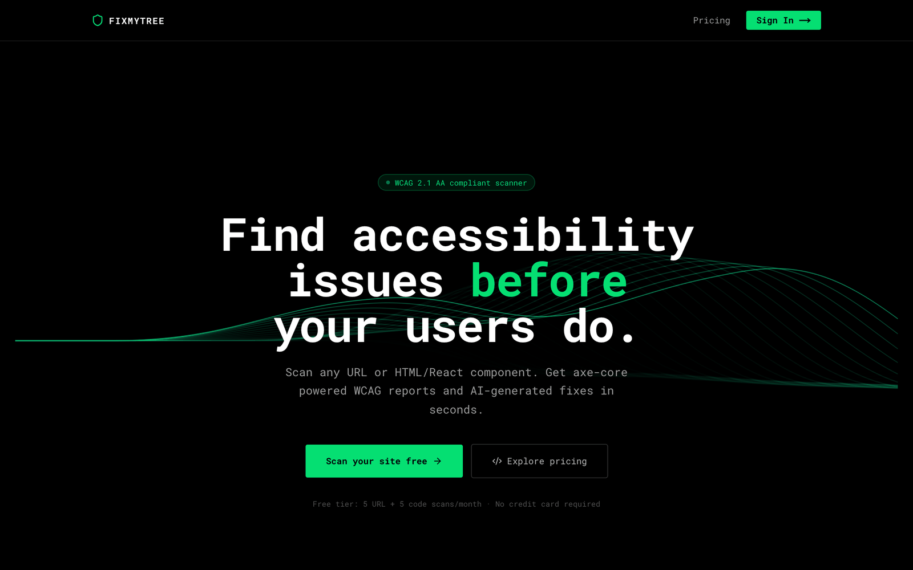
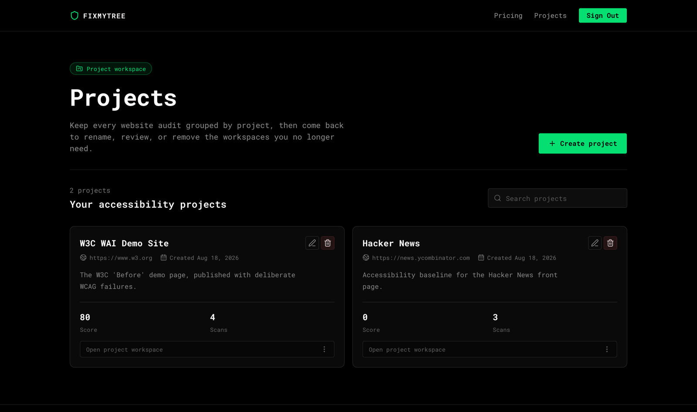
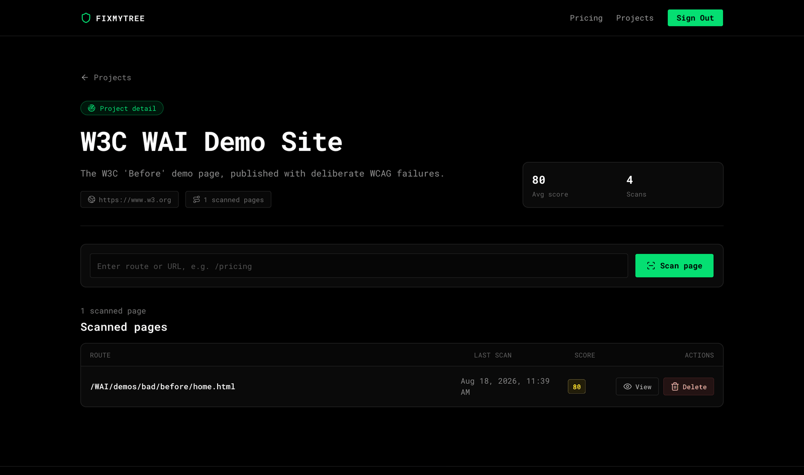
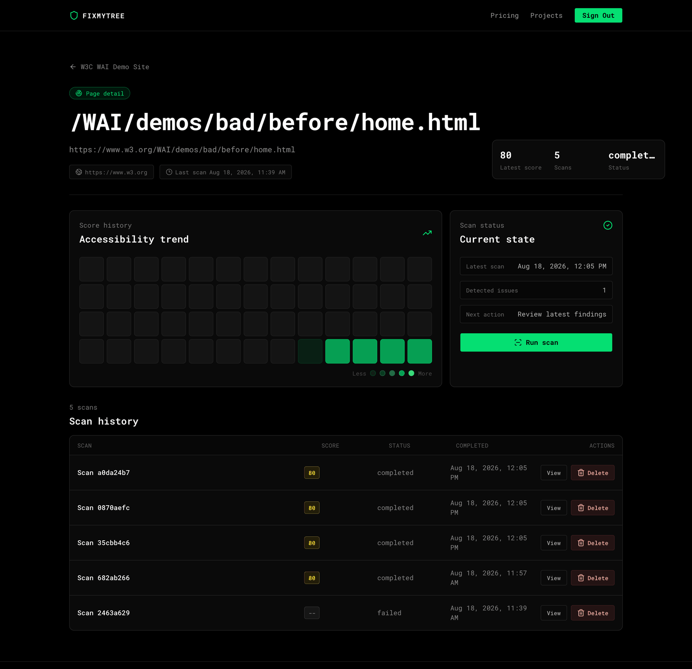
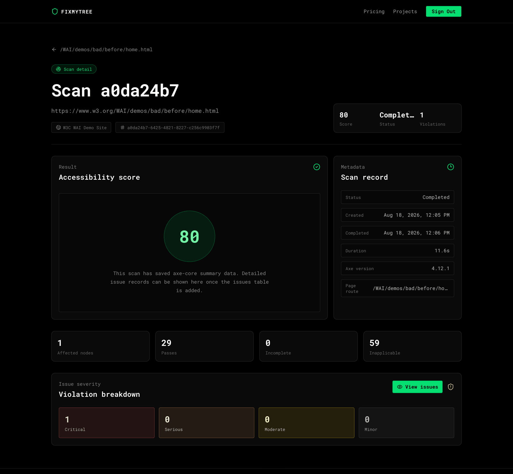
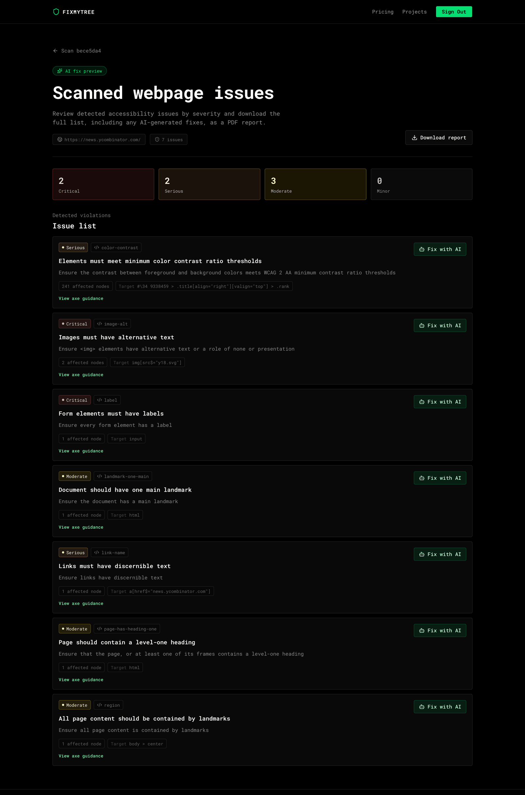
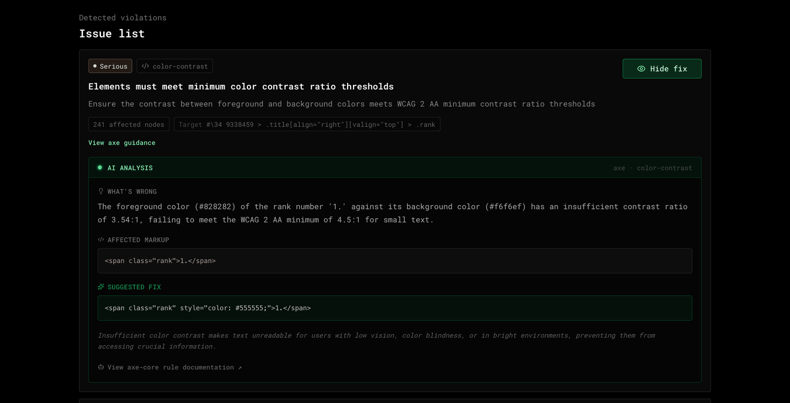
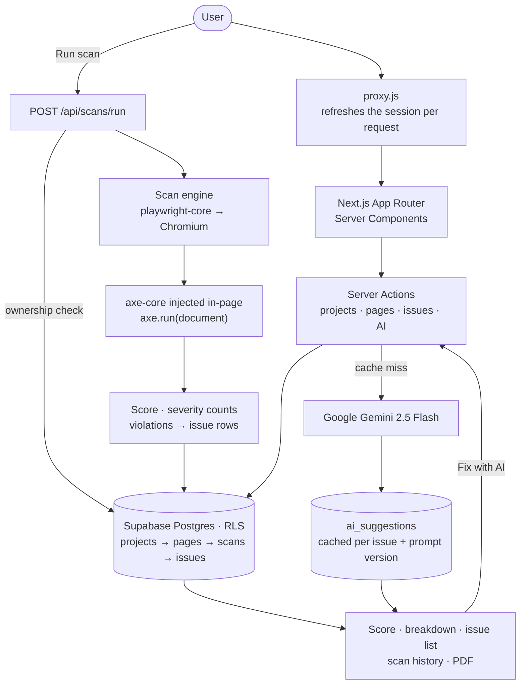

# Website Accessibility Analyser

Website Accessibility Analyser (shipped as **FixMyTree**) loads any public web page in a real headless Chromium browser, runs the axe-core rule engine against the fully-rendered DOM, and turns each WCAG violation into an AI-generated code fix. It is for developers and teams who need to find *and* remediate accessibility problems, not just read audit output.

## Product Preview



**Live Demo:** https://website-accessibility-analyser-six.vercel.app/

**Source Code: Private**

> The source code is private because this project is being developed as a potential commercial product. This repository provides a public showcase of the product, architecture, technical decisions, and engineering approach.

## Key Features

- **Real-browser scanning** — Chromium loads the page and waits for the network to settle, so JavaScript-rendered markup is analysed too.
- **Weighted accessibility score** — 0–100, penalised by each violation's impact and node count.
- **Complete violation records** — rule ID, impact, description, axe guidance link, WCAG tags, and every affected node with its HTML, selector and failure summary.
- **Severity and rule totals** — critical / serious / moderate / minor counts, plus passes, inapplicable, and *incomplete* rules needing human review.
- **AI remediation** — Gemini returns what's wrong, corrected markup, and why it matters; answers are cached.
- **Scan history** — every scan retained per page, with a score-trend heatmap.
- **Projects and pages** — a project owns a base URL; pages must share that origin.
- **PDF export** — issues, severities and generated fixes, built client-side.
- **Failure transparency** — blocked or timed-out scans are stored as `failed` with an explanatory message.
- **Google sign-in** — projects, scans and suggestions are scoped to their owner.

## Product Screenshots

|                                                          |                                                         |
| -------------------------------------------------------- | ------------------------------------------------------- |
|  |  |
| Projects with their current score and scan count          | Pages tracked under one project, added by route or URL  |
|             |            |
| Score trend and scan history for a single page            | Score, axe totals and severity breakdown for one scan   |
|           |          |
| Each violation with rule ID, affected nodes and target    | Gemini's explanation, corrected markup and impact       |

## Architecture



A scan is one synchronous request: confirm the page belongs to the signed-in user, write a `pending` row, launch Chromium, navigate, inject axe-core, run it. The result is reduced to a score, four severity counts and the pass/incomplete/inapplicable totals; the row becomes `completed` and one `issues` row is written per violation with its affected nodes as JSON. Anything that throws updates the same row to `failed`. AI generation is separate — *Fix with AI* checks the cache before reaching Gemini.

## Tech Stack

**Frontend** — Next.js 16 (App Router), React 19, Tailwind CSS v4, shadcn/ui on Radix, lucide-react, sonner, nextjs-toploader, OGL for the WebGL hero.
**Authentication** — Supabase Auth with Google OAuth; session refresh in `proxy.js` (Next.js 16's replacement for middleware).
**Database** — Supabase PostgreSQL with Row Level Security.
**Scanning** — playwright-core, `@sparticuz/chromium` for the serverless build, axe-core.
**AI** — Google Gemini (`@google/genai`, `gemini-2.5-flash`).
**Reporting** — jsPDF.
**DevOps** — GitHub Actions, ESLint, `npm audit`, Vercel.

## Technical Decisions

**Scans run through an API route, not a Server Action** → the bundle needs the Chromium binary traced into it, and `outputFileTracingIncludes` attaches that to one concrete route path → the ~50 MB browser payload ships only with `/api/scans/run`. The scan logic stays a Server Action, dynamically imported inside the handler.

**axe-core is evaluated in-page rather than added as a script tag** → `addScriptTag` fetches a resource, which a target site's Content Security Policy can refuse → the library's source is compiled inside the page and attached to `window`, so a CSP blocking external scripts doesn't end the scan.

**Scoring is computed in the app** → axe reports violations, not a grade → fixed impact weights (critical 20, serious 12, moderate 6, minor 2) times affected nodes, subtracted from 100, make scores comparable across scans — which is what makes the trend heatmap meaningful.

**AI answers are cached by issue and prompt version** → the same violation yields the same fix, and Gemini calls cost money and seconds → suggestions are keyed on `issue_id` + `prompt_version`, so reopening an issue is a database read, and bumping the version invalidates every cached answer at once.

**Ownership is enforced in queries as well as by RLS** → RLS is the backstop, but a query that silently returns nothing can't be told apart from a real 404 → helpers resolve a record only when the `projects.user_id` chain reaches the current user, so actions return a true "not found" while the database stays independently guarded.

## Engineering Challenges

**Running a real browser on serverless infrastructure** → Playwright's own Chromium download doesn't exist in a Lambda filesystem, and function bundles exclude binaries by default → `@sparticuz/chromium` supplies a Lambda-compatible build, `playwright-core` avoids bundling browsers, file tracing includes the binary explicitly, and the launcher detects `VERCEL`/`AWS_LAMBDA_FUNCTION_NAME` to pick the right executable → one scanner code path for both environments.

**Getting axe-core into arbitrary third-party pages** → strict CSPs block injected scripts, and axe's UMD bundle needs a `module`/`exports` shape to attach itself → its source is evaluated against a synthesised module object, `window.axe` is set from the exports if the UMD branch takes over, and `axe.run` is asserted before continuing → injection no longer depends on the site allowing an external script.

**Sites that refuse automated browsers** → large commercial sites block headless traffic or stall past the timeout, surfacing as an opaque failure → a realistic user agent, locale and viewport are set, HTTP/2 is disabled, network-idle is best-effort, and error text is pattern-matched into a specific "this site blocked the scan" message → users get something actionable instead of a stack trace.

**Modelling a long request as a visible lifecycle** → a scan is one blocking call, but the UI needs pending, completed and failed states and rows must never be orphaned → a `pending` row is written before the browser launches and updated in both the success and failure paths → every scan reaches a terminal state, and a failed one keeps its timestamps and message.

## Accessibility & Performance

**In the product** — semantic landmarks (`main`, `nav`, `footer`, `article`), a document language, labelled controls with visually-hidden labels where the design has no visible one, `sr-only` text on icon-only buttons, `focus-visible` rings on interactive cards and links, and layouts responsive from mobile up. Every asynchronous action has a loading state (scan overlay, AI skeleton, per-row deleting state), an empty state, and an error path. Server Components keep list and detail pages server-rendered, and scan detail fetches its scan and issues in parallel. The interface has **not** had an independent accessibility audit, and no Lighthouse or Core Web Vitals figures are quoted because none have been measured.

**In the scanning engine** — axe-core runs its default rule set against the rendered document. Each scan stores violations (rule ID, impact, description, guidance URL, WCAG and best-practice tags), affected nodes with their HTML and selectors, axe's failure summary, and counts of rules that passed, were inapplicable, or came back *incomplete*. Incomplete results are reported rather than folded into the score, because automated tooling cannot decide them.


## CI/CD & Engineering Practices

```text
Push / Pull Request to main
        ↓
GitHub Actions (ubuntu-latest, Node 22)
        ↓  restore .next/cache
      npm ci
        ↓
      ESLint                     ← blocking
        ↓
  Next.js production build       ← blocking
        ↓
  npm audit --audit-level=high   ← reported, non-blocking
        ↓
  Vercel deploys main
```

Lint and build failures stop the run and the pull request. The audit runs every time but is deliberately non-blocking, so an upstream advisory doesn't freeze delivery while it is triaged. Deployment is Vercel's Git integration rather than a workflow step, keeping Actions purely a quality gate. Work lands as ticketed branches merged through pull requests.

## Security & Data Access

Authentication is Google OAuth through Supabase, with the session in cookies and refreshed before every request. Server Components redirect unauthenticated visitors away from project, page and scan routes, and every Server Action re-derives the user server-side rather than trusting client input.

Authorization is layered: reads and writes resolve a record only by walking the ownership chain — issue → scan → page → project → owner — so another user's ID resolves to nothing, while Row Level Security restricts the tables independently. The Gemini key and all service credentials are server-only environment variables, and the AI call happens inside a Server Action, unreachable from the browser. Scans accept only `http`/`https` URLs, and pages are constrained to their project's origin.

## Project Structure

```text
Website Accessibility Analyser
├── Authentication          Google OAuth, session refresh, route protection
├── Projects & Pages        workspaces, origin-constrained page URLs
├── Scan Pipeline           lifecycle, status transitions, failure handling
├── Browser Automation      Chromium launch, navigation, environment resolution
├── Accessibility Analysis  axe-core injection, violation normalisation, scoring
├── Issues & Scan History   issue records, severity breakdown, score trend
├── AI Suggestions          prompt construction, response validation, caching
├── Reporting               PDF export of issues and generated fixes
├── Database                Postgres schema, ownership joins, RLS
└── CI/CD                   lint, build, audit, deployment
```

## Engineering Takeaways

Building this meant getting a real browser to run inside a serverless function, and getting an analysis library into pages that actively resist injected scripts — constraints that only appear once you scan the open web instead of a fixture. It also meant designing a schema where authorization is a property of the data model, turning a noisy audit tool into a score a user can track, treating an LLM as an untrusted service needing parsing, retries and a cache, and keeping every scan honest about whether it worked.
